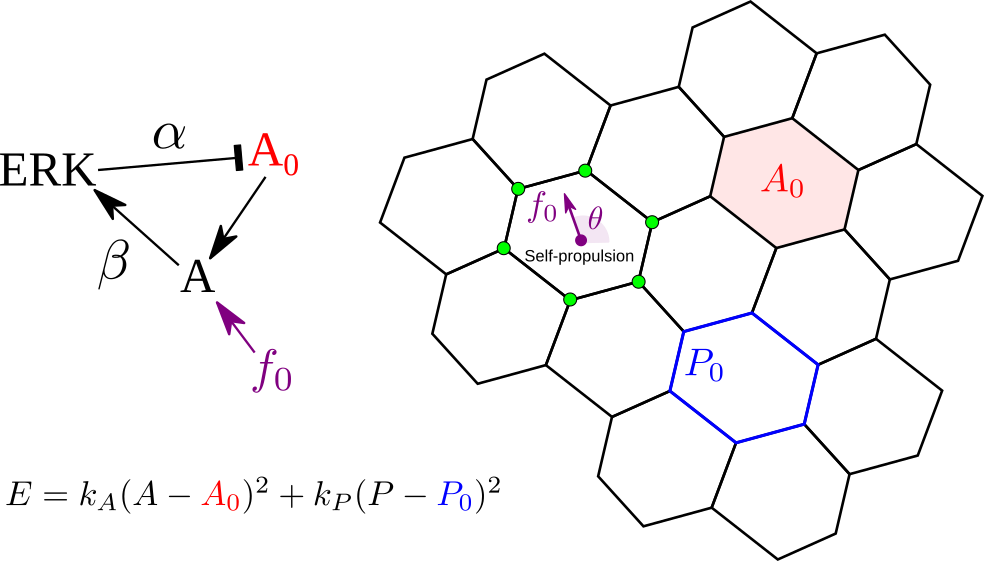

# Vertex model simulations of mechanochemical ERK waves with a persistent random walk

This software was developed using the user project template of
Chaste. See the [User
Projects](https://chaste.cs.ox.ac.uk/trac/wiki/ChasteGuides/UserProjects)
guide on the Chaste wiki for more information.

The software runs vertex model simulations based on the models
presented in the following publications/preprints:

+ Boocock et al Nature Physics (2021) doi: [10.1038/s41567-020-01037-7](https://doi.org/10.1038/s41567-020-01037-7)
+ Boocock et al bioRxiv (2023) doi: [10.1101/2023.03.24.534111](https://doi.org/10.1101/2023.03.24.534111)

The code can be used to reproduce the simulation results presented in
Boocock et al (2023).

# Installation

Before installation of this user project you will first need to
download and install a version of
[Chaste](https://github.com/Chaste/Chaste). Simulations in Boocock et
al (2023) were performed using [Chaste
2019.1](https://github.com/Chaste/Chaste/tree/release_2019.1) and
[Chaste 2021.1](https://github.com/Chaste/Chaste/tree/release_2021.1)
(recommended).

There are various ways of [obtaining
Chaste](https://chaste.cs.ox.ac.uk/trac/wiki/GettingStarted). One
method is to clone from the [Chaste github
repository](https://github.com/Chaste/Chaste) and change branch to a
specific release:

    git clone https://github.com/Chaste/Chaste.git
	cd Chaste
    git checkout release_2021.1
	
You then need to follow instructions to [install
dependencies](https://chaste.cs.ox.ac.uk/trac/wiki/InstallGuides/InstallGuide)
and for [first time configuration and
build](https://chaste.cs.ox.ac.uk/trac/wiki/ChasteGuides/CmakeFirstRun).

Once you have a working installation of Chaste, clone the erk\_waves
repository to the user projects directory and compile following the
instructions in the [User
Projects](https://chaste.cs.ox.ac.uk/trac/wiki/ChasteGuides/UserProjects)
guide. When running setup.py you only need to select yes for the
cell\_based component. To speed up simulations change
"CMAKE\_BUILD\_TYPE" from "Debug" to "Release".

    cd Chaste/projects
	git clone https://github.com/DBoocock/erk_waves.git
	cd erk_waves
	python setup_project.py
	cd path/to/chaste_build    # e.g. cd ~/home/chaste_build
	ccmake path/to/Chaste    # e.g. ccmake ~/home/Chaste
	make TestERKWaveWithSelfPropulsionNoAlignment

The "python" directory within the cloned repository contains a Python
script for specifying combinations of parameter values and launching
parralel simulations. Copy or move this directory to a convenient
location and modify "batch\_erk\_propulsion\_no\_alignment.py" to
point to the location of the compiled C++ executable in your build
(default
"~/chaste\_build/projects/erk\_waves/test/TestERKWaveWithSelfPropulsionNoAlignment").

To run:

    python batch_erk_propulsion_no_alignment.py

Simulation output will be saved to a location specified by the system
environment variable "CHASTE\_TEST\_OUTPUT" which you may set as
desired. The output directory includes a file "params.txt" documenting
parameter values as well as a csv file
"results\_from\_time\_xxxx/cell\_data.dat" containing simulation data
(the data to save is specified in the ErkPropulsionWriterNoAlignment
class). Within each row of "cell\_data.dat" the first column gives the
simulation timepoint, then columns repeat in blocks of 8 containing
the following information for each cell:

    location_index    # Redundant with cell_id
    cell_id    # Unique cell identifier
	x, y    # Cell centroid location
    erk    # ERK level
    A0    # Target area
    A    # Cell area
    theta    # Angle of self-propulsion

Simulations can be visualized using
[ParaView](https://www.paraview.org/download/): open ParaView and
simply import the pvd file from the location
"results\_from\_time\_xxxx/results.pvd" (consult the [Chaste
Tutorials](https://chaste.cs.ox.ac.uk/chaste/tutorials/release_2021.1/UserTutorials.html)
for further information).

The analysis of simulation output published in Boocock et al (2023)
was performed using a suite of Python scripts and modules that are
available with data using the following [download
link](https://seafile.ist.ac.at/f/7538561b4dba4bf69d49/) (850MB
download).
